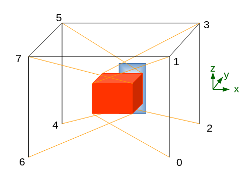

# groupeMath
Math group repository.

## Table of contents

1. [ How to ](#1-how-to)  
    1.1. [ Get the latest codes ](#11-get-the-latest-codes)  
    1.2. [ Modify the code ](#12-modify-the-code)  
    1.3. [ Push the codes ](#13-push-the-codes)
2. [ Structure ](#2-structure)
3. [ Coding conventions ](#3-coding-conventions)  
    3.1. [ Documenting and commenting ](#31-documenting-and-commenting)
4. [ Tests ](#4-tests)
5. [ Pics ](#5-pics)

## 1. How to

### 1.1. Get the latest codes

In a terminal, eventually the `git terminal`:
```bash
# go to your folder
cd path/to/folder
# get the latest version of the code
git pull
```

### 1.2. Modify the code

Then, in order to modify your codes, you are going to create a branch for you. It means that you are going to work on a version of the code wothout impacting the other branches.
In order to do so:
```bash
git branch
>> master
>> classes
# create the branch pierre
git branch pierre
# go on the branch pierre
git checkout pierre
```
Then you can modify the codes.
You only need to do this once. Then, you'll automatically be on the `pierre` branch (you can see it in the terminal between brackets), so no need to type this.

### 1.3. Push the codes

Once you are done, if you want to push the changes you made, type:
```bash
git add .
git commit -m "Message describing the changes"
git push
```
The changes you made are now on GitHub, on the branch that you previously created.
Don't forget to `git pull` each time you want to work on the codes!

## 2. Structure

- `cable_robot.py`:
- `calculs.py`: discretisation and motors rotation computation, main script;
- `cli.py`:
- `command.py`:
- `gen.py`:
- `groupeMathSquelette`: this script is outdated, was a previous version of `calculs.py`;
- `modules`:
    - `decorators.py`: decorators for a cleaner code, it is ok if you don't look at it;
    - `objects.py`: classes needed for the `calculs.py` script;
    - `utils.py`: useful tools and functions.


### 2.1. `calculs.py`

We want to compute the number of steps in which we are going to divide each interval of the trajectory.
For each interval, this number is
`max(ceil(L_i/dx_i)_i)`
where `i` in `[|1,6|]` is the dimension, `L_i` is the distance we want to do in the interval and `dx_i` is the maximum step authorized.

## 3. Coding conventions

### 3.1. Documenting and commenting

When a function is defined, we document it as follows:
```py
def fun(arg):
    """
    Blabla

    :param dimensions: blabla

    :type dimensions: np.array

    :return: blabla
    :rtype: np.array
    """
    pass
```

## 4. Tests

For now, no unittest has been implemented and the `.py` files in the `test/` folder are empty.
To run the tests, type in a terminal:
```bash
python -m unittest
```

## 5. Pics

- motor numbering:


